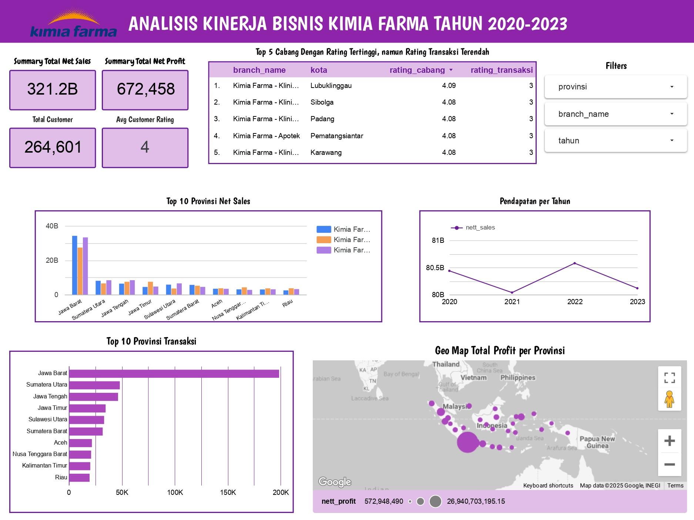

# 📊Project Based Internship Big Data Analytics Kimia Farma

## 📌Program Description
This project analyzes the business performance of Kimia Farma from 2020 to 2023 as part of a data analytics internship. Using SQL in BigQuery, multiple datasets were cleaned, joined, and transformed into a single analytical table. The final output is an interactive dashboard in Looker Studio showing metrics like net sales, profit, and customer ratings across branches and provinces.

Throughout this project, participants received:
- Practical experience using Google BigQuery for data transformation and SQL query optimization
- Skills in building a centralized analytical table from multiple datasets
- Ability to create interactive data dashboards using Looker Studio
- Exposure to real-world business case analysis (transaction, profit, customer behavior)
- Improved data storytelling and insight communication for stakeholders
- Portfolio-ready project demonstrating end-to-end data analytics workflow

## 🏥About Kimia Farma
Kimia Farma is one of the leading pharmaceutical companies in Indonesia, established in 1817. The company operates across the pharmaceutical value chain, including manufacturing, distribution, retail pharmacy, and clinical laboratory services. With a vast network of branches and outlets across the country, Kimia Farma is committed to improving public health by providing high-quality and affordable healthcare products and services. As a state-owned enterprise, the company plays a significant role in supporting national health programs and contributing to the growth of the healthcare industry in Indonesia.

## 🎯Project Objectives
- Transform raw datasets into a structured analytical table using SQL in BigQuery
- Analyze business performance based on sales, profit, and customer satisfaction
- Evaluate branch performance across cities and provinces
- Build an interactive dashboard in Looker Studio for visualizing insights
- Support data-driven decision-making through clear metrics and visualizations

## 🛠️Tools Used
- **Google Big Query** – for data warehousing and querying
- **SQL** – for data processing and analysis
- **Google Looker Studio** – for dashboard creation and data visualization

## 📂Datasets
The following datasets were used:
1. `kf_final_transaction` – Final transaction data
2. `kf_inventory` – Inventory data
3. `kf_kantor_cabang` – Branch office information
4. `kf_product` – Product details

[Datasets](https://drive.google.com/drive/folders/12yJjYMFnsrZbYuLcb4RNjGUdItXsRoL1?usp=sharing)

## 🔗SQL Query Used:
```sql
CREATE OR REPLACE TABLE `kimia-farma-x-rakamin-458710.kimia_farma.tabel_analisa` AS
SELECT
  t.transaction_id,
  DATE(t.date) AS date,
  t.branch_id,
  kc.branch_name,
  kc.kota,
  kc.provinsi,

  -- Rata-rata rating per cabang
  AVG(t.rating) OVER (PARTITION BY t.branch_id) AS rating_cabang,

  t.customer_name,
  t.product_id,
  p.product_name,
  t.price AS actual_price,
  t.discount_percentage,

  -- Persentase Gross Laba
  CASE
    WHEN t.price <= 50000 THEN 0.10
    WHEN t.price <= 100000 THEN 0.15
    WHEN t.price <= 300000 THEN 0.20
    WHEN t.price <= 500000 THEN 0.25
    ELSE 0.30
  END AS persentase_gross_laba,

  -- Nett Sales
  t.price * (1 - t.discount_percentage) AS nett_sales,

  -- Nett Profit
  (t.price * (1 - t.discount_percentage)) *
  CASE
    WHEN t.price <= 50000 THEN 0.10
    WHEN t.price <= 100000 THEN 0.15
    WHEN t.price <= 300000 THEN 0.20
    WHEN t.price <= 500000 THEN 0.25
    ELSE 0.30
  END AS nett_profit,

  t.rating AS rating_transaksi

FROM
  `kimia-farma-x-rakamin-458710.kimia_farma.kf_final_transaction` t
LEFT JOIN
  `kimia-farma-x-rakamin-458710.kimia_farma.kf_kantor_cabang` kc ON t.branch_id = kc.branch_id
LEFT JOIN
  `kimia-farma-x-rakamin-458710.kimia_farma.kf_product` p ON t.product_id = p.product_id;

-- Tabel top 5 cabang rating tinggi tapi rating transaksi rendah
CREATE OR REPLACE TABLE `kimia-farma-x-rakamin-458710.kimia_farma.top_5_rating_cabang_bingung` AS
WITH cabang_rating_summary AS (
  SELECT
    branch_id,
    branch_name,
    kota,
    provinsi,
    AVG(rating_cabang) AS avg_rating_cabang,
    AVG(rating_transaksi) AS avg_rating_transaksi
  FROM
    `kimia-farma-x-rakamin-458710.kimia_farma.tabel_analisa`
  GROUP BY
    branch_id, branch_name, kota, provinsi
)

SELECT *
FROM cabang_rating_summary
ORDER BY avg_rating_cabang DESC, avg_rating_transaksi ASC
LIMIT 5;
```

## 📊Dashboard

[View Full Dashboard on Looker Studio](https://lookerstudio.google.com/reporting/b01b9660-4d3a-4097-8657-13034449d752)

## 👤Author
**Qothrun Nadaa Chairunnisa**<br>
Big Data Analytics Intern – Rakamin x Kimia farma
